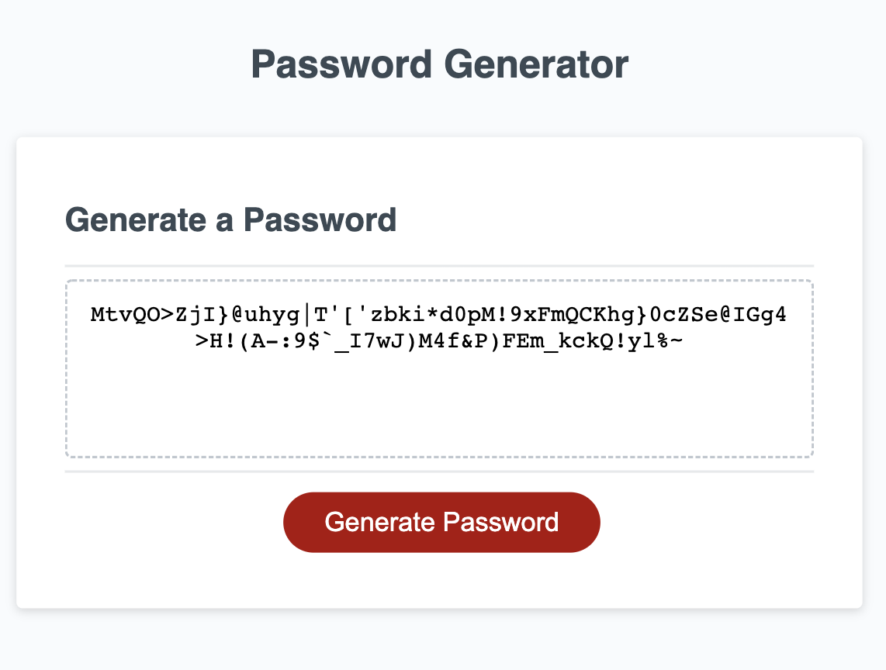

# Password Generator

 

There are global arrays at the top with all the character options.  The rest of the document uses if statements to determine if each group of characters should be used in the passwords.

Using the concat method, the selected characters move into an empty array.  Then a for loop is used to figure out your new password.

<a href="https://sacylkowski.github.io/password-generator/">Here is the link to the webpage</a>

